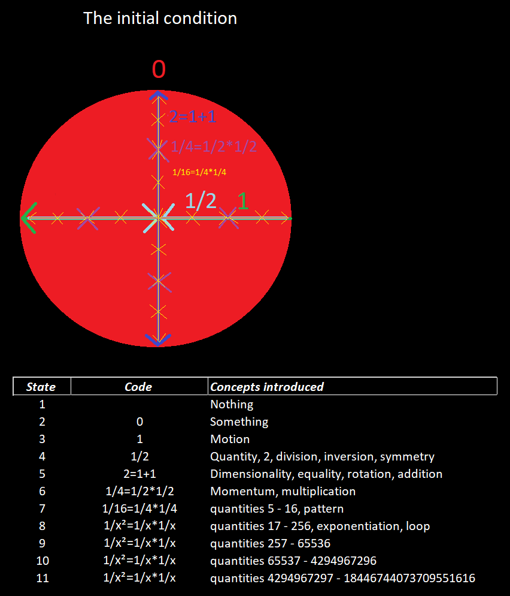

Now that the universe is initialized, I can explain how it works.

Starting from first principles, the universe must begin with nothing, then something, then motion. But nothing is defined as the absence of something, so if the universe starts with nothing, then at that point we wouldn’t refer to it as nothing, we would just simply say that’s how it is. It’s only when we have something, a point particle, then we can speak of what it means to materialize into physical existence.

A reasonable starting point for thinking about the origin of the universe is to consider the very first point particle that ever existed and its very first motion. Keep in mind that when the universe is in this state, the notion of quantity does not yet exist. The idea that there is 2 of something has yet to be conceived.
A revelation seemingly yet to be realized is that there’s no reference point for any outward facing motion for the first point particle. If the particle moves in one direction, any direction or any expansion, then there’s no way of knowing the particle is in motion because the before and after states always look the same, just blank empty space in all directions. The only reference point for any type of motion for the first point particle is its own interior radius. The trick is to realize that a point particle is not a point particle from the perspective of that particle but from the outside observer it does. The beauty of this first inward facing vector is that it resolves a difficult philosophical paradox. The universe does not consume any additional space over time, it uses fractal flow and has O(1) space complexity, now and forever. We can think of the universe as just one point particle that uses fractal flow to redefine its interior as being the width of the universe.

The second vector, or state transition, is just an inversion of the first and achieves the beauty of symmetry quite early in the initial conditions. Next, we add the 2nd dimension by defining a rotation as some difference in symmetry between the first 2 vectors. From here, we’ve instantiated the first surface without violating any first principles, namely the assumption that quantity as a concept already exists. The operations of inversion and rotation, applied to a single vector, are seemingly all that’s needed to render the universe. We can define math as the study of points in space and physics is a particular configuration of points moving through space. Namely, the challenge of physics is to solve for bidirectional data flow in three dimensions to and from the 2nd dimension. This is what it means to observe 3D space and what we refer to as the spin property. 

Now that the universe is initialized as a surface, we must determine how to energize hadron ground states and distribute them from the initial condition. 

jmb
